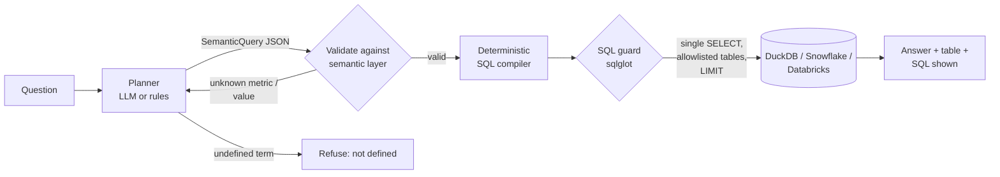

# Commercial Analytics Agent

**Ask questions about pharma commercial data in plain English and get correct, governed answers.** The agent never writes SQL. It translates each question into a structured query over a **semantic layer** (metrics and dimensions defined once, in YAML), and a deterministic compiler turns that into SQL. Every query passes a SQL guard before it runs. Questions about things the layer doesn't define get an honest "not defined" instead of a made-up number.

Built with dbt (DuckDB locally), sqlglot, Pydantic and MLflow. Compiled SQL transpiles to **Snowflake, Databricks or BigQuery**.

## The problem

Commercial and brand teams ask the analytics team the same questions all week: TRx by territory, NRx trends for a brand, share by therapeutic area. Text-to-SQL chatbots promise self-service, but free-form SQL generation fails in ways that are hard to see. It invents joins, picks the wrong definition of "sales", or quietly answers a question nobody can answer from the data (profit, forecasts). In regulated industries a confident wrong number is worse than no answer.

## Design: semantic layer first



- **The semantic layer** (`semantic/commercial.yml`) defines 6 metrics (TRx, NRx, net sales, active prescribers, average sales per Rx, own-brand share) and 9 dimensions, each with synonyms. It also lists deliberately undefined terms (profit, margin, forecast). Definitions live in one reviewed file, not in a prompt.
- **The planner** produces a `SemanticQuery` (metrics, group-by, filters, time range, order, limit). With a real model it gets the catalog and the valid dimension values, and validation errors are fed back once for self-correction. Offline, a rule-based planner does synonym and pattern matching, including relative dates ("last quarter", "year to date", "past 12 months").
- **The compiler** builds SQL from the definitions, so joins and metric formulas are always the approved ones.
- **Validation** rejects unknown metrics, dimensions and filter values. Filter values must exactly match values in the data, so injected text never reaches SQL.
- **The SQL guard** parses the final SQL with sqlglot and requires a single `SELECT`, no DDL or DML, allowlisted tables only, and a `LIMIT`. This is defense in depth even though the SQL is compiled.
- **Portability:** `--dialect snowflake|databricks|bigquery` prints the same query transpiled for the customer's warehouse.

```text
$ python -m askdata "Top 3 territories by TRx last quarter"
Total prescriptions (TRx) by territory from Apr 01, 2026 to Jun 30, 2026: Chicago (206), New York (194), Seattle (193).

$ python -m askdata "What is our profit margin by brand?"
'profit' isn't defined in the semantic layer, so I won't estimate it. Defined metrics: Total prescriptions (TRx), ...
```

The data is a fictional pharma commercial dataset: 15,000+ prescriptions from 120 prescribers in 12 territories, for 6 invented brands, Jan 2025 to Sep 2026. It's built by dbt from seeds with relationship and uniqueness tests.

## Evaluation (execution accuracy)

`evals/golden.yml` has 20 questions with **hand-written golden SQL**, written independently of the semantic layer. `evals/run_evals.py` runs them through `mlflow.genai.evaluate` and compares the agent's result sets to the golden ones.

| Scorer | Offline rule planner |
|---|---|
| `execution_accuracy`: result set equals the golden result | **85%** |
| `refusal_correct`: refuses exactly when it should | 95% |
| `no_answer_to_undefined`: never answers profit, forecasts and the like (**safety gate**) | 100% |
| `sql_is_safe`: every query passes the guard (**safety gate**) | 100% |
| Fact table intact after a `DROP TABLE` injection attempt | yes |

The misses are the three **paraphrase** questions: "heart doctors" for Cardiology, "new scripts ... month over month", and "sell the most in dollars". Keyword rules break on everyday wording, and one paraphrase is wrongly refused. That's exactly the gap an LLM planner should close. Run with `LLM_PROVIDER=databricks` (or `azure`/`openai`) to measure it. The safety gates hold either way, because they're enforced by code, not the model.

## Run it

```bash
pip install -r requirements.txt
python scripts/generate_data.py && (cd dbt && dbt build --profiles-dir .)
PYTHONPATH=src python -m askdata "Which region had the highest net sales in 2025?"
PYTHONPATH=src python -m askdata "Monthly NRx for Xelvora this year" --dialect snowflake
python evals/run_evals.py
pytest
```

## Why this design (for customer conversations)

- **Trust:** business users see the semantic query and the SQL behind every number.
- **Governance:** metric definitions are reviewed once by the data team. The LLM can't redefine "net sales".
- **Safety by construction:** the model never writes SQL, and the guard enforces read-only access even if something upstream is wrong.
- **Fits existing stacks:** the same pattern maps directly to dbt Semantic Layer / MetricFlow, Snowflake semantic views with Cortex Analyst, and Databricks metric views with Genie.

## Next steps

- LLM planner evaluation across models, with the golden set as the scoreboard
- Clarifying questions for ambiguous requests ("which time period?") instead of defaulting to all time
- Row-level security by territory, so reps only see their own data
